# Aqua Note データベース設計書

## 概要

Aqua Noteは水槽管理（アクアリウム管理）用のWebアプリケーションです。
このドキュメントでは、アプリケーションのデータベーススキーマ設計について詳細に記載します。

## 設計方針

- **データベース**: Cloudflare D1 (SQLite互換)
- **ORM**: Drizzle ORM
- **マルチテナント**: user_idによる完全なデータ分離
- **完全スキーマ**: サービスローンチ後の変更を避けるため、最初から全機能のテーブルを実装
- **外部キー制約**: データの整合性を保証
- **インデックス**: 頻繁にアクセスされるカラムに適切に設定
- **日付・時刻統一**: 全てTEXT型（ISO 8601形式）で統一、SQLiteの日付関数を活用
- **部分インデックス**: 実際の使用パターンに基づく条件付きインデックスでパフォーマンス最適化

## ID戦略（ULID採用の理由）

すべてのテーブルの主キーにULID（Universally Unique Lexicographically Sortable Identifier）を採用しています。

### ULIDを選択した理由

1. **Cloudflare D1との親和性**
   - SQLiteはTEXT型の主キーでも高速に動作
   - Cloudflareのグローバル分散環境に適合

2. **時系列ソート可能**
   - タイムスタンプが先頭に含まれるため、文字列ソートで時系列順になる
   - `ORDER BY id`だけで作成順のソートが可能（created_atの代替にもなる）
   - 例: `01ARZ3NDEKTSV4RRFFQ69G5FAV` < `01ARZ3NDEKTSV4RRFFQ69G5FAW`

3. **分散環境での利点**
   - クライアント側でID生成可能（オフライン対応、楽観的更新）
   - 複数のWorkerインスタンスで同時生成しても衝突しない
   - データ移行やバックアップ・リストア時のID衝突リスクなし

4. **セキュリティ**
   - 自動増分IDと違い、他ユーザーのデータ量が推測できない
   - URLに含めても連番攻撃のリスクが低い

5. **開発効率**
   - 128ビット（26文字）で表現され、UUIDと同等の一意性
   - UUIDv4と違い、デバッグ時に時系列が分かりやすい

### 実装例

```typescript
import { ulid } from 'ulid';

// ID生成
const newId = ulid(); // "01ARZ3NDEKTSV4RRFFQ69G5FAV"

// タイムスタンプ部分の抽出も可能
const text = decodeTime(newId); // ミリ秒単位のUnixタイムスタンプ
```

## 日付・時刻の統一設計

全ての日付・時刻フィールドをTEXT型（ISO 8601形式）で統一:

```sql
-- 日付のみ: "2024-01-15"
setup_date TEXT

-- 日時: "2024-01-15T10:30:00.000Z"
created_at TEXT
performed_at TEXT
```

SQLiteの強力な日付関数を活用:

```sql
-- 今日の作業
WHERE date(performed_at) = date('now')

-- 先週の記録  
WHERE performed_at >= date('now', '-7 days')

-- 月別集計
SELECT strftime('%Y-%m', performed_at) as month, count(*)
FROM maintenance_records GROUP BY month
```

## ER図

### 1. 認証・決済システム

```mermaid
---
title: Aqua Note - 認証・決済システム
---
erDiagram
    users ||--o{ sessions : "has"
    users ||--o{ oauth_accounts : "has"
    users ||--o| subscriptions : "has"
    users ||--o{ payment_histories : "has"
    users ||--o{ audit_logs : "performs"
    users ||--o| user_preferences : "has"
    users ||--o| user_profiles : "has"
    users ||--o{ multi_factor_auth : "has"
    
    subscriptions ||--o{ payment_histories : "generates"
    stripe_webhook_events ||--o{ subscriptions : "updates"
    stripe_webhook_events ||--o{ payment_histories : "creates"

    users {
        string id PK "ULID"
        string email UK "unique, not null"
        string username UK "unique, not null"
        string display_name
        string profile_photo_url
        string password_hash "nullable for OAuth users"
        string stripe_customer_id UK "nullable"
        text email_verified_at
        text created_at "not null"
        text updated_at "not null"
    }

    sessions {
        string id PK "ULID"
        string user_id FK "not null"
        text expires_at "not null"
        text created_at "not null"
    }

    oauth_accounts {
        string id PK "ULID"
        string user_id FK "not null"
        string provider "google/github/twitter"
        string provider_user_id "not null"
        string provider_email
        string access_token "encrypted"
        string refresh_token "encrypted"
        text expires_at
        text created_at "not null"
        text updated_at "not null"
        
        UK_provider_user "provider, provider_user_id"
    }

    subscriptions {
        string id PK "ULID"
        string user_id FK "unique, not null"
        string stripe_subscription_id UK
        string stripe_price_id
        string plan_type "free/basic/premium, default: free"
        string status "active/canceled/past_due/trialing"
        text current_period_start
        text current_period_end
        boolean cancel_at_period_end "default: false"
        text canceled_at
        text trial_start
        text trial_end
        integer aquarium_limit "default: 1"
        integer photo_storage_mb "default: 100"
        text created_at "not null"
        text updated_at "not null"
    }

    payment_histories {
        string id PK "ULID"
        string user_id FK "not null"
        string stripe_payment_intent_id UK
        string stripe_invoice_id UK
        integer amount "in cents/yen"
        string currency "default: jpy"
        string status "succeeded/failed/pending"
        string description
        text paid_at
        text created_at "not null"
    }

    stripe_webhook_events {
        string id PK "ULID"
        string stripe_event_id UK "not null"
        string type "not null"
        boolean processed "default: false"
        string error_message
        json payload "not null"
        text created_at "not null"
        text processed_at
    }

    multi_factor_auth {
        string id PK "ULID"
        string user_id FK "not null"
        string type "totp/sms/backup_codes"
        string secret "encrypted"
        boolean verified "default: false"
        text last_used_at
        text created_at "not null"
        text updated_at "not null"
    }

    user_preferences {
        string id PK "ULID"
        string user_id FK "unique, not null"
        string language "ja/en, default: ja"
        string timezone "default: Asia/Tokyo"
        boolean email_notifications "default: true"
        boolean push_notifications "default: false"
        json notification_settings
        string theme "light/dark/auto, default: light"
        text created_at "not null"
        text updated_at "not null"
    }

    audit_logs {
        string id PK "ULID"
        string user_id FK
        string action "not null"
        string entity_type
        string entity_id
        json old_values
        json new_values
        string ip_address
        string user_agent
        text created_at "not null"
    }

    user_profiles {
        string id PK "ULID"
        string user_id FK "unique, not null"
        string location
        string biography
        text created_at "not null"
        text updated_at "not null"
    }
```

### 2. アクアリウム管理システム

```mermaid
---
title: Aqua Note - アクアリウム管理システム
---
erDiagram
    users ||--o{ aquariums : "owns"
    users ||--o{ notifications : "receives"
    
    aquariums ||--o| aquarium_specs : "has"
    aquariums ||--o{ aquarium_livestock : "contains"
    aquariums ||--o{ maintenance_records : "has"
    aquariums ||--o{ water_parameters : "has"
    aquariums ||--o{ aquarium_photos : "has"
    aquariums ||--o{ maintenance_schedules : "has"
    aquariums ||--o{ aquarium_tag_relations : "has"
    
    tags ||--o{ aquarium_tag_relations : "used_in"
    maintenance_records ||--o| water_changes : "details"
    maintenance_records ||--o| feeding_records : "details"
    maintenance_records ||--o{ additive_records : "details"
    maintenance_records ||--o| observation_records : "details"
    maintenance_records ||--o{ record_photos : "has"
    maintenance_schedules ||--o{ notifications : "triggers"

    tags {
        string id PK "ULID"
        string name UK "not null"
        string display_name
        integer usage_count "default: 0"
        text created_at "not null"
        text updated_at "not null"
    }

    aquarium_tag_relations {
        string aquarium_id FK "not null"
        string tag_id FK "not null"
        text created_at "not null"
    }

    users {
        string id PK "ULID"
        string display_name
    }

    aquariums {
        string id PK "ULID"
        string user_id FK "not null"
        string name "not null"
        string description
        integer volume_liters "not null"
        boolean is_active "default: true"
        boolean is_public "default: false"
        integer view_count "default: 0"
        text published_at
        string photo_url
        text created_at "not null"
        text updated_at "not null"
    }

    aquarium_specs {
        string id PK "ULID"
        string aquarium_id FK "unique, not null"
        string tank_type "freshwater/saltwater/brackish"
        text setup_date
        string substrate_type "sand/gravel/soil/bare"
        string substrate_brand
        real substrate_depth_cm
        string lighting_type "led/fluorescent/metal_halide"
        integer lighting_hours_daily
        string lighting_brand
        integer lighting_wattage
        string co2_type "none/pressurized/diy/liquid"
        integer co2_bps "bubbles per second"
        string filter_type "external/internal/sump/hang_on_back"
        string filter_brand
        integer filter_flow_rate "L/h"
        integer heater_wattage
        real target_temperature_c
        text created_at "not null"
        text updated_at "not null"
    }

    aquarium_livestock {
        string id PK "ULID"
        string aquarium_id FK "not null"
        string species_name "not null"
        string common_name
        string livestock_type "fish/shrimp/snail/coral/plant/other"
        integer quantity "default: 1"
        text added_date "not null"
        text removed_date
        string removal_reason
        string notes
        text created_at "not null"
        text updated_at "not null"
    }

    maintenance_records {
        string id PK "ULID"
        string aquarium_id FK "not null"
        text performed_at "not null"
        string category "water_change/feeding/additives/cleaning/observation/other"
        string title
        string description
        string notes
        text created_at "not null"
        text updated_at "not null"
    }

    water_changes {
        string id PK "ULID"
        string maintenance_record_id FK "unique, not null"
        real volume_liters "not null"
        real percentage
        string water_conditioner
        real water_conditioner_ml
        real old_temperature_c
        real new_temperature_c
        text created_at "not null"
    }

    feeding_records {
        string id PK "ULID"
        string maintenance_record_id FK "unique, not null"
        string food_type "not null"
        real amount_grams
        string notes
        text created_at "not null"
    }

    additive_records {
        string id PK "ULID"
        string maintenance_record_id FK "not null"
        string additive_name "not null"
        real amount_ml "not null"
        string purpose
        string notes
        text created_at "not null"
    }

    water_parameters {
        string id PK "ULID"
        string aquarium_id FK "not null"
        text measured_at "not null"
        real temperature_c
        real ph
        real ammonia_ppm
        real nitrite_ppm
        real nitrate_ppm
        real gh_dh
        real kh_dh
        real phosphate_ppm
        real salinity_ppt
        string notes
        text created_at "not null"
    }

    observation_records {
        string id PK "ULID"
        string maintenance_record_id FK "unique, not null"
        string mood "good/normal/concern/problem"
        string weather
        text created_at "not null"
    }

    aquarium_photos {
        string id PK "ULID"
        string aquarium_id FK "not null"
        string photo_url "not null"
        string thumbnail_url
        string caption
        text taken_date
        integer file_size_kb "not null"
        text created_at "not null"
    }

    record_photos {
        string id PK "ULID"
        string maintenance_record_id FK "not null"
        string photo_url "not null"
        string thumbnail_url
        string caption
        integer file_size_kb "not null"
        text created_at "not null"
    }

    maintenance_schedules {
        string id PK "ULID"
        string aquarium_id FK "not null"
        string schedule_name "not null"
        json categories "array of strings"
        integer interval_days "not null"
        time preferred_time
        text last_performed_date
        text next_due_date "not null"
        boolean is_active "default: true"
        boolean notification_enabled "default: true"
        integer notification_hours_before "default: 24"
        text created_at "not null"
        text updated_at "not null"
    }

    notifications {
        string id PK "ULID"
        string user_id FK "not null"
        string schedule_id FK
        string type "schedule/alert/reminder/system"
        string title "not null"
        string message "not null"
        string status "pending/sent/read/cancelled"
        text scheduled_for
        text sent_at
        text read_at
        text created_at "not null"
    }
```



## テーブル詳細設計

### 認証・ユーザー管理テーブル

#### 1. users（ユーザー）

ユーザーの基本情報を管理するテーブル。OAuth認証とStripe連携に対応。

| カラム名 | 型 | 制約 | 説明 |
|---------|-----|------|------|
| id | TEXT | PRIMARY KEY | ULID形式の一意識別子 |
| email | TEXT | UNIQUE, NOT NULL | メールアドレス |
| username | TEXT | UNIQUE, NOT NULL | ユーザー名（表示用） |
| display_name | TEXT | | 表示名 |
| profile_photo_url | TEXT | | プロフィール写真URL |
| password_hash | TEXT | | パスワードハッシュ（OAuth専用ユーザーはNULL） |
| stripe_customer_id | TEXT | UNIQUE | Stripe顧客ID |
| email_verified_at | TEXT | | メール確認日時 |
| created_at | TEXT | NOT NULL | 作成日時 |
| updated_at | TEXT | NOT NULL | 更新日時 |

**インデックス**:

- `idx_users_email` (email)
- `idx_users_username` (username)
- `idx_users_stripe_customer_id` (stripe_customer_id)

#### 2. sessions（セッション）

ユーザーのログインセッション管理。

| カラム名 | 型 | 制約 | 説明 |
|---------|-----|------|------|
| id | TEXT | PRIMARY KEY | ULID形式の一意識別子 |
| user_id | TEXT | NOT NULL, FK(users.id) | ユーザーID |
| expires_at | TEXT | NOT NULL | セッション有効期限 |
| created_at | TEXT | NOT NULL | 作成日時 |

**インデックス**:

- `idx_sessions_user_id` (user_id)
- `idx_sessions_expires_at` (expires_at)

#### 3. oauth_accounts（OAuth連携）

外部認証プロバイダーとの連携情報を管理。

| カラム名 | 型 | 制約 | 説明 |
|---------|-----|------|------|
| id | TEXT | PRIMARY KEY | ULID形式の一意識別子 |
| user_id | TEXT | NOT NULL, FK(users.id) | ユーザーID |
| provider | TEXT | NOT NULL | プロバイダー名 (google/github/twitter) |
| provider_user_id | TEXT | NOT NULL | プロバイダー側のユーザーID |
| provider_email | TEXT | | プロバイダーから取得したメール |
| access_token | TEXT | | アクセストークン（暗号化推奨） |
| refresh_token | TEXT | | リフレッシュトークン（暗号化推奨） |
| expires_at | TEXT | | トークン有効期限 |
| created_at | TEXT | NOT NULL | 作成日時 |
| updated_at | TEXT | NOT NULL | 更新日時 |

**制約**:

- **UNIQUE制約**: `(provider, provider_user_id)` - 同一プロバイダでの重複登録を防止

**インデックス**:

- `idx_oauth_accounts_user_id` (user_id)

#### 4. subscriptions（サブスクリプション）

ユーザーのサブスクリプション情報。Stripe連携対応。

| カラム名 | 型 | 制約 | 説明 |
|---------|-----|------|------|
| id | TEXT | PRIMARY KEY | ULID形式の一意識別子 |
| user_id | TEXT | UNIQUE, NOT NULL, FK(users.id) | ユーザーID |
| stripe_subscription_id | TEXT | UNIQUE | Stripeサブスクリプション |
| stripe_price_id | TEXT | | Stripe料金プランID |
| plan_type | TEXT | NOT NULL, DEFAULT 'free' | プランタイプ (free/basic/premium) |
| status | TEXT | NOT NULL | ステータス (active/canceled/past_due/trialing) |
| current_period_start | TEXT | | 現在の請求期間開始 |
| current_period_end | TEXT | | 現在の請求期間終了 |
| cancel_at_period_end | BOOLEAN | DEFAULT FALSE | 期間終了時にキャンセル |
| canceled_at | TEXT | | キャンセル日時 |
| trial_start | TEXT | | トライアル開始日時 |
| trial_end | TEXT | | トライアル終了日時 |
| aquarium_limit | INTEGER | DEFAULT 1 | 登録可能水槽数 |
| photo_storage_mb | INTEGER | DEFAULT 100 | 写真ストレージ容量(MB) |
| created_at | TEXT | NOT NULL | 作成日時 |
| updated_at | TEXT | NOT NULL | 更新日時 |

**インデックス**:

- `idx_subscriptions_user_id` (user_id)
- `idx_subscriptions_stripe_subscription_id` (stripe_subscription_id)
- `idx_subscriptions_status` (status)

#### 5. payment_histories（支払い履歴）

Stripeでの支払い履歴を記録。

| カラム名 | 型 | 制約 | 説明 |
|---------|-----|------|------|
| id | TEXT | PRIMARY KEY | ULID形式の一意識別子 |
| user_id | TEXT | NOT NULL, FK(users.id) | ユーザーID |
| stripe_payment_intent_id | TEXT | UNIQUE | Stripe決済インテントID |
| stripe_invoice_id | TEXT | UNIQUE | Stripe請求書ID |
| amount | INTEGER | NOT NULL | 金額（円単位） |
| currency | TEXT | DEFAULT 'jpy' | 通貨 |
| status | TEXT | NOT NULL | ステータス (succeeded/failed/pending) |
| description | TEXT | | 説明 |
| paid_at | TEXT | | 支払い日時 |
| created_at | TEXT | NOT NULL | 作成日時 |

**インデックス**:

- `idx_payment_histories_user_id` (user_id)
- `idx_payment_histories_paid_at` (paid_at)

#### 6. stripe_webhook_events（Stripeウェブフック）

Stripeからのウェブフックイベントを管理。

| カラム名 | 型 | 制約 | 説明 |
|---------|-----|------|------|
| id | TEXT | PRIMARY KEY | ULID形式の一意識別子 |
| stripe_event_id | TEXT | UNIQUE, NOT NULL | StripeイベントID |
| type | TEXT | NOT NULL | イベントタイプ |
| processed | BOOLEAN | DEFAULT FALSE | 処理済みフラグ |
| error_message | TEXT | | エラーメッセージ |
| payload | JSON | NOT NULL | イベントペイロード |
| created_at | TEXT | NOT NULL | 作成日時 |
| processed_at | TEXT | | 処理日時 |

**インデックス**:

- `idx_stripe_webhook_events_stripe_event_id` (stripe_event_id)
- `idx_stripe_webhook_events_processed` (processed)

#### 7. multi_factor_auth（多要素認証）

二要素認証の設定情報。

| カラム名 | 型 | 制約 | 説明 |
|---------|-----|------|------|
| id | TEXT | PRIMARY KEY | ULID形式の一意識別子 |
| user_id | TEXT | NOT NULL, FK(users.id) | ユーザーID |
| type | TEXT | NOT NULL | 認証タイプ (totp/sms/backup_codes) |
| secret | TEXT | | シークレット（暗号化必須） |
| verified | BOOLEAN | DEFAULT FALSE | 検証済みフラグ |
| last_used_at | TEXT | | 最終使用日時 |
| created_at | TEXT | NOT NULL | 作成日時 |
| updated_at | TEXT | NOT NULL | 更新日時 |

**インデックス**:

- `idx_multi_factor_auth_user_id` (user_id)

#### 8. user_preferences（ユーザー設定）

ユーザーの個人設定情報。

| カラム名 | 型 | 制約 | 説明 |
|---------|-----|------|------|
| id | TEXT | PRIMARY KEY | ULID形式の一意識別子 |
| user_id | TEXT | UNIQUE, NOT NULL, FK(users.id) | ユーザーID |
| language | TEXT | DEFAULT 'ja' | 言語設定 (ja/en) |
| timezone | TEXT | DEFAULT 'Asia/Tokyo' | タイムゾーン |
| email_notifications | BOOLEAN | DEFAULT TRUE | メール通知有効 |
| push_notifications | BOOLEAN | DEFAULT FALSE | プッシュ通知有効 |
| notification_settings | JSON | | 詳細な通知設定 |
| theme | TEXT | DEFAULT 'light' | テーマ (light/dark/auto) |
| created_at | TEXT | NOT NULL | 作成日時 |
| updated_at | TEXT | NOT NULL | 更新日時 |

**インデックス**:

- `idx_user_preferences_user_id` (user_id)

#### 9. user_profiles（ユーザープロフィール）

ユーザーの詳細プロフィール情報。コミュニティ機能での交流促進用。

| カラム名 | 型 | 制約 | 説明 |
|---------|-----|------|------|
| id | TEXT | PRIMARY KEY | ULID形式の一意識別子 |
| user_id | TEXT | UNIQUE, NOT NULL, FK(users.id) | ユーザーID |
| location | TEXT | | 地域（関東、大阪、California等、自由記述） |
| biography | TEXT | | 自己紹介文 |
| created_at | TEXT | NOT NULL | 作成日時 |
| updated_at | TEXT | NOT NULL | 更新日時 |

**インデックス**:

- `idx_user_profiles_user_id` (user_id)

#### 10. audit_logs（監査ログ）

重要操作の履歴を記録。

| カラム名 | 型 | 制約 | 説明 |
|---------|-----|------|------|
| id | TEXT | PRIMARY KEY | ULID形式の一意識別子 |
| user_id | TEXT | FK(users.id) | ユーザーID（システム操作はNULL） |
| action | TEXT | NOT NULL | アクション名 |
| entity_type | TEXT | | エンティティタイプ |
| entity_id | TEXT | | エンティティID |
| old_values | JSON | | 変更前の値 |
| new_values | JSON | | 変更後の値 |
| ip_address | TEXT | | IPアドレス |
| user_agent | TEXT | | ユーザーエージェント |
| created_at | TEXT | NOT NULL | 作成日時 |

**インデックス**:

- `idx_audit_logs_user_id` (user_id)
- `idx_audit_logs_entity` (entity_type, entity_id)
- `idx_audit_logs_created_at` (created_at)

### アクアリウム管理テーブル

#### 11. aquariums（水槽）

水槽の基本情報を管理。ログイン不要での公開閲覧機能に対応。

| カラム名 | 型 | 制約 | 説明 |
|---------|-----|------|------|
| id | TEXT | PRIMARY KEY | ULID形式の一意識別子 |
| user_id | TEXT | NOT NULL, FK(users.id) | 所有者のユーザーID |
| name | TEXT | NOT NULL | 水槽名 |
| description | TEXT | | 説明 |
| volume_liters | INTEGER | NOT NULL | 水量（リットル） |
| is_active | BOOLEAN | DEFAULT TRUE | アクティブフラグ |
| is_public | BOOLEAN | DEFAULT FALSE | 公開フラグ（TRUE=誰でも閲覧可能） |
| view_count | INTEGER | DEFAULT 0 | 閲覧数（公開時のみカウント） |
| published_at | TEXT | | 初回公開日時 |
| photo_url | TEXT | | メイン写真URL |
| created_at | TEXT | NOT NULL | 作成日時 |
| updated_at | TEXT | NOT NULL | 更新日時 |

**インデックス**:

- `idx_aquariums_user_id` (user_id)
- `idx_aquariums_is_active` (is_active)
- `idx_aquariums_is_public` (is_public)
- `idx_aquariums_published_at` (published_at)

**部分インデックス**（パフォーマンス最適化）:

- `idx_aquariums_active_user` (user_id) WHERE is_active = 1 - アクティブ水槽のみ
- `idx_aquariums_public_published` (published_at) WHERE is_public = 1 - 公開水槽のみ

#### 12. aquarium_specs（水槽仕様）

水槽の詳細仕様・設備情報を管理。上級者向けの詳細設定。

| カラム名 | 型 | 制約 | 説明 |
|---------|-----|------|------|
| id | TEXT | PRIMARY KEY | ULID形式の一意識別子 |
| aquarium_id | TEXT | UNIQUE, NOT NULL, FK(aquariums.id) | 水槽ID |
| tank_type | TEXT | | 水槽タイプ (freshwater/saltwater/brackish) |
| setup_date | TEXT | | セットアップ日 |
| substrate_type | TEXT | | 底床タイプ (sand/gravel/soil/bare) |
| substrate_brand | TEXT | | 底床ブランド |
| substrate_depth_cm | REAL | | 底床厚さ（cm） |
| lighting_type | TEXT | | 照明タイプ (led/fluorescent/metal_halide) |
| lighting_hours_daily | INTEGER | | 1日の照明時間 |
| lighting_brand | TEXT | | 照明ブランド |
| lighting_wattage | INTEGER | | 照明ワット数 |
| co2_type | TEXT | | CO2タイプ (none/pressurized/diy/liquid) |
| co2_bps | INTEGER | | CO2添加量（bubbles per second） |
| filter_type | TEXT | | フィルタータイプ (external/internal/sump/hang_on_back) |
| filter_brand | TEXT | | フィルターブランド |
| filter_flow_rate | INTEGER | | フィルター流量（L/h） |
| heater_wattage | INTEGER | | ヒーターワット数 |
| target_temperature_c | REAL | | 目標水温（℃） |
| created_at | TEXT | NOT NULL | 作成日時 |
| updated_at | TEXT | NOT NULL | 更新日時 |

**インデックス**:

- `idx_aquarium_specs_aquarium_id` (aquarium_id)
- `idx_aquarium_specs_tank_type` (tank_type)

#### 13. tags（タグマスタ）

水槽のタグ情報を管理するマスタテーブル。コミュニティ機能の基盤。

| カラム名 | 型 | 制約 | 説明 |
|---------|-----|------|------|
| id | TEXT | PRIMARY KEY | ULID形式の一意識別子 |
| name | TEXT | UNIQUE, NOT NULL | タグ名（ネオンテトラ、流木など） |
| display_name | TEXT | | 表示名（日本語名など） |
| usage_count | INTEGER | DEFAULT 0 | 使用回数（人気度指標） |
| created_at | TEXT | NOT NULL | 作成日時 |
| updated_at | TEXT | NOT NULL | 更新日時 |

**インデックス**:

- `idx_tags_name` (name)
- `idx_tags_usage_count` (usage_count)

#### 14. aquarium_tag_relations（水槽タグ関連）

水槽とタグの多対多関係を管理する中間テーブル。

| カラム名 | 型 | 制約 | 説明 |
|---------|-----|------|------|
| aquarium_id | TEXT | NOT NULL, FK(aquariums.id) | 水槽ID |
| tag_id | TEXT | NOT NULL, FK(tags.id) | タグID |
| created_at | TEXT | NOT NULL | 関連付け日時 |

**主キー**: `(aquarium_id, tag_id)`

**インデックス**:

- `idx_aquarium_tag_relations_aquarium_id` (aquarium_id)
- `idx_aquarium_tag_relations_tag_id` (tag_id)

#### 15. aquarium_livestock（飼育生体）

水槽内の生体情報を管理。魚、エビ、貝、サンゴ、水草など全ての生体に対応。

| カラム名 | 型 | 制約 | 説明 |
|---------|-----|------|------|
| id | TEXT | PRIMARY KEY | ULID形式の一意識別子 |
| aquarium_id | TEXT | NOT NULL, FK(aquariums.id) | 水槽ID |
| species_name | TEXT | NOT NULL | 種名（学名） |
| common_name | TEXT | | 一般名 |
| livestock_type | TEXT | | 生体タイプ (fish/shrimp/snail/coral/plant/other) |
| quantity | INTEGER | DEFAULT 1 | 個体数 |
| added_date | TEXT | NOT NULL | 導入日 |
| removed_text | TEXT | | 取り出し日 |
| removal_reason | TEXT | | 取り出し理由 |
| notes | TEXT | | 備考 |
| created_at | TEXT | NOT NULL | 作成日時 |
| updated_at | TEXT | NOT NULL | 更新日時 |

**インデックス**:

- `idx_aquarium_livestock_aquarium_id` (aquarium_id)
- `idx_aquarium_livestock_added_date` (added_date)
- `idx_aquarium_livestock_type` (livestock_type)

#### 16. maintenance_records（メンテナンス記録）

メンテナンス作業の共通情報を管理。詳細は各作業種別テーブルで管理。

| カラム名 | 型 | 制約 | 説明 |
|---------|-----|------|------|
| id | TEXT | PRIMARY KEY | ULID形式の一意識別子 |
| aquarium_id | TEXT | NOT NULL, FK(aquariums.id) | 水槽ID |
| performed_at | TEXT | NOT NULL | 実施日時 |
| category | TEXT | NOT NULL | 作業カテゴリ (water_change/feeding/additives/cleaning/observation/other) |
| title | TEXT | | 作業タイトル（例:「週末の水換え」） |
| description | TEXT | | 作業内容の詳細 |
| notes | TEXT | | 備考 |
| created_at | TEXT | NOT NULL | 作成日時 |
| updated_at | TEXT | NOT NULL | 更新日時 |

**インデックス**:

- `idx_maintenance_records_aquarium_id` (aquarium_id)
- `idx_maintenance_records_performed_at` (performed_at)
- `idx_maintenance_records_category` (category)

#### 17. water_changes（水換え詳細）

水換え作業の詳細情報。

| カラム名 | 型 | 制約 | 説明 |
|---------|-----|------|------|
| id | TEXT | PRIMARY KEY | ULID形式の一意識別子 |
| maintenance_record_id | TEXT | UNIQUE, NOT NULL, FK(maintenance_records.id) | メンテナンス記録ID |
| volume_liters | REAL | NOT NULL | 交換水量（リットル） |
| percentage | REAL | | 交換率（%） |
| water_conditioner | TEXT | | 使用カルキ抜き剤 |
| water_conditioner_ml | REAL | | カルキ抜き剤使用量(ml) |
| old_temperature_c | REAL | | 交換前水温（℃） |
| new_temperature_c | REAL | | 交換後水温（℃） |
| created_at | TEXT | NOT NULL | 作成日時 |

**インデックス**:

- `idx_water_changes_maintenance_record_id` (maintenance_record_id)

#### 18. feeding_records（給餌詳細）

給餌作業の詳細情報。

| カラム名 | 型 | 制約 | 説明 |
|---------|-----|------|------|
| id | TEXT | PRIMARY KEY | ULID形式の一意識別子 |
| maintenance_record_id | TEXT | UNIQUE, NOT NULL, FK(maintenance_records.id) | メンテナンス記録ID |
| food_type | TEXT | NOT NULL | 餌の種類 |
| amount_grams | REAL | | 給餌量（グラム） |
| notes | TEXT | | 備考 |
| created_at | TEXT | NOT NULL | 作成日時 |

**インデックス**:

- `idx_feeding_records_maintenance_record_id` (maintenance_record_id)

#### 19. additive_records（添加剤投入詳細）

添加剤投入作業の詳細情報。複数の添加剤を同時投入した場合は複数レコード。

| カラム名 | 型 | 制約 | 説明 |
|---------|-----|------|------|
| id | TEXT | PRIMARY KEY | ULID形式の一意識別子 |
| maintenance_record_id | TEXT | NOT NULL, FK(maintenance_records.id) | メンテナンス記録ID |
| additive_name | TEXT | NOT NULL | 添加剤名 |
| amount_ml | REAL | NOT NULL | 投入量（ml） |
| purpose | TEXT | | 投入目的（pH調整、水質改善など） |
| notes | TEXT | | 備考 |
| created_at | TEXT | NOT NULL | 作成日時 |

**インデックス**:

- `idx_additive_records_maintenance_record_id` (maintenance_record_id)
- `idx_additive_records_additive_name` (additive_name)

#### 20. observation_records（観察記録詳細）

日常観察・飼育日記の詳細情報。

| カラム名 | 型 | 制約 | 説明 |
|---------|-----|------|------|
| id | TEXT | PRIMARY KEY | ULID形式の一意識別子 |
| maintenance_record_id | TEXT | UNIQUE, NOT NULL, FK(maintenance_records.id) | メンテナンス記録ID |
| mood | TEXT | | 水槽の調子 (good/normal/concern/problem) |
| weather | TEXT | | 天気（環境要因として記録） |
| created_at | TEXT | NOT NULL | 作成日時 |

**インデックス**:

- `idx_observation_records_maintenance_record_id` (maintenance_record_id)
- `idx_observation_records_mood` (mood)

#### 21. water_parameters（水質パラメータ）

水質測定結果の記録。

| カラム名 | 型 | 制約 | 説明 |
|---------|-----|------|------|
| id | TEXT | PRIMARY KEY | ULID形式の一意識別子 |
| aquarium_id | TEXT | NOT NULL, FK(aquariums.id) | 水槽ID |
| measured_at | TEXT | NOT NULL | 測定日時 |
| temperature_c | REAL | | 水温（℃） |
| ph | REAL | | pH値 |
| ammonia_ppm | REAL | | アンモニア濃度(ppm) |
| nitrite_ppm | REAL | | 亜硝酸塩濃度(ppm) |
| nitrate_ppm | REAL | | 硝酸塩濃度(ppm) |
| gh_dh | REAL | | 総硬度(°dH) |
| kh_dh | REAL | | 炭酸塩硬度(°dH) |
| phosphate_ppm | REAL | | リン酸塩濃度(ppm) |
| salinity_ppt | REAL | | 塩分濃度(ppt) |
| notes | TEXT | | 備考 |
| created_at | TEXT | NOT NULL | 作成日時 |

**インデックス**:

- `idx_water_parameters_aquarium_id` (aquarium_id)
- `idx_water_parameters_measured_at` (measured_at)

#### 22. aquarium_photos（水槽写真）

水槽の写真管理。

| カラム名 | 型 | 制約 | 説明 |
|---------|-----|------|------|
| id | TEXT | PRIMARY KEY | ULID形式の一意識別子 |
| aquarium_id | TEXT | NOT NULL, FK(aquariums.id) | 水槽ID |
| photo_url | TEXT | NOT NULL | 写真URL |
| thumbnail_url | TEXT | | サムネイルURL |
| caption | TEXT | | キャプション |
| taken_date | TEXT | | 撮影日 |
| file_size_kb | INTEGER | NOT NULL | ファイルサイズ(KB) |
| created_at | TEXT | NOT NULL | 作成日時 |

#### 23. record_photos（記録写真）

メンテナンス作業や観察記録に紐づく写真管理。

| カラム名 | 型 | 制約 | 説明 |
|---------|-----|------|------|
| id | TEXT | PRIMARY KEY | ULID形式の一意識別子 |
| maintenance_record_id | TEXT | NOT NULL, FK(maintenance_records.id) | メンテナンス記録ID |
| photo_url | TEXT | NOT NULL | 写真URL |
| thumbnail_url | TEXT | | サムネイルURL |
| caption | TEXT | | キャプション |
| file_size_kb | INTEGER | NOT NULL | ファイルサイズ(KB) |
| created_at | TEXT | NOT NULL | 作成日時 |

**インデックス**:

- `idx_record_photos_maintenance_record_id` (maintenance_record_id)

#### 24. maintenance_schedules（メンテナンススケジュール）

定期メンテナンスのスケジュール管理。統合されたメンテナンス記録に対応。

| カラム名 | 型 | 制約 | 説明 |
|---------|-----|------|------|
| id | TEXT | PRIMARY KEY | ULID形式の一意識別子 |
| aquarium_id | TEXT | NOT NULL, FK(aquariums.id) | 水槽ID |
| schedule_name | TEXT | NOT NULL | スケジュール名（例:「週末の水換え」） |
| categories | JSON | NOT NULL | 実施する作業カテゴリ ['water_change', 'cleaning'] |
| interval_days | INTEGER | NOT NULL | 実施間隔（日） |
| preferred_time | TEXT | | 希望実施時刻 |
| last_performed_text | TEXT | | 最終実施日 |
| next_due_date | TEXT | NOT NULL | 次回予定日 |
| is_active | BOOLEAN | DEFAULT TRUE | 有効フラグ |
| notification_enabled | BOOLEAN | DEFAULT TRUE | 通知有効フラグ |
| notification_hours_before | INTEGER | DEFAULT 24 | 通知タイミング（時間前） |
| created_at | TEXT | NOT NULL | 作成日時 |
| updated_at | TEXT | NOT NULL | 更新日時 |

**インデックス**:

- `idx_maintenance_schedules_aquarium_id` (aquarium_id)
- `idx_maintenance_schedules_next_due_date` (next_due_date)
- `idx_maintenance_schedules_is_active` (is_active)

**部分インデックス**（パフォーマンス最適化）:

- `idx_schedules_active_due` (next_due_date) WHERE is_active = 1 AND notification_enabled = 1 - アクティブな通知スケジュールのみ

#### 25. notifications（通知）

ユーザーへの通知管理。

| カラム名 | 型 | 制約 | 説明 |
|---------|-----|------|------|
| id | TEXT | PRIMARY KEY | ULID形式の一意識別子 |
| user_id | TEXT | NOT NULL, FK(users.id) | ユーザーID |
| schedule_id | TEXT | FK | スケジュールID |
| type | TEXT | | 通知タイプ |
| title | TEXT | NOT NULL | タイトル |
| message | TEXT | NOT NULL | メッセージ |
| status | TEXT | | ステータス |
| scheduled_for | TEXT | | 予定送信日時 |
| sent_at | TEXT | | 送信日時 |
| read_at | TEXT | | 既読日時 |
| created_at | TEXT | NOT NULL | 作成日時 |

**インデックス**:

- `idx_notifications_user_id` (user_id)
- `idx_notifications_schedule_id` (schedule_id)
- `idx_notifications_status` (status)
- `idx_notifications_scheduled_for` (scheduled_for)

**部分インデックス**（パフォーマンス最適化）:

- `idx_notifications_unread` (scheduled_for) WHERE status = 'pending' - 未読通知のみ
