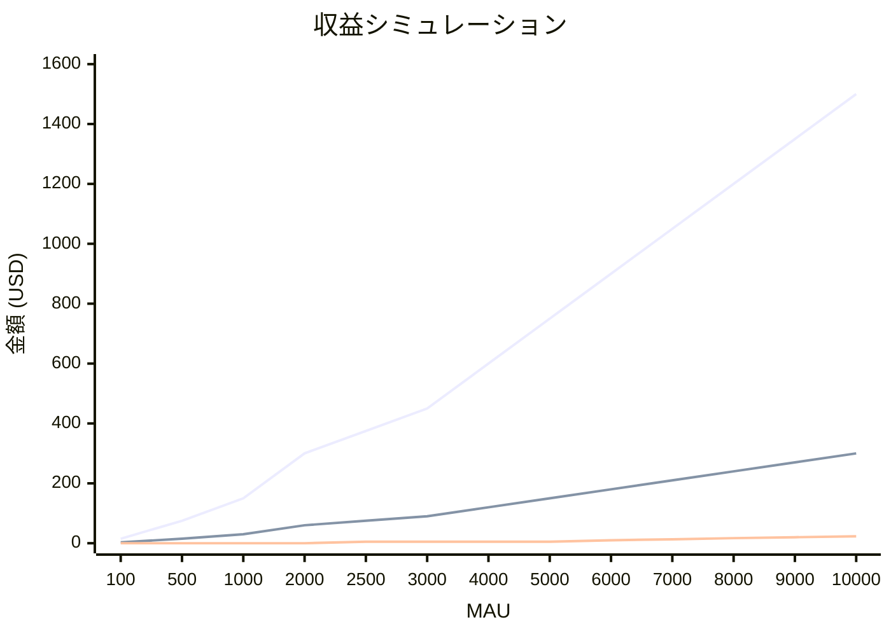

# 🐠 Aqua Note Revenue Plan

## 収益モデルとコスト試算

### 料金設定

#### 無料プラン (Free)

- 水槽1つまで
- メンテナンス記録無制限
- 写真1枚（最新のみ保存）
- 基本的なグラフ表示

#### 有料プラン (Premium)

- **月額プラン**: $3/月（約450円）
- **年額プラン**: $24/年（$2/月相当、約3,600円/年）※33%お得
- 水槽無制限
- アルバム機能（写真無制限）
- リマインダー・通知機能
- 高度な分析・レポート
- データエクスポート（CSV/PDF）
- 優先サポート

### Cloudflareインフラコスト

| サービス      | 無料枠       | 想定使用量/ユーザー  | 無料枠上限MAU |
| ------------- | ------------ | -------------------- | ------------- |
| Workers/Pages | 300万 req/月 | 500 req/月（保守的） | 6,000 MAU     |
| D1 読み取り   | 1.5億 行/月  | 1,000 行/月          | 150,000 MAU   |
| D1 書き込み   | 300 万行/月  | 100 行/月            | 30,000 MAU    |
| D1 ストレージ | 5 GB         | 2 MB                 | 2,500 MAU     |
| R2 ストレージ | 10 GB        | 200 KB               | 50,000 MAU    |

**→ 最も制約となるD1ストレージで約2,500 MAU、Workersで約6,000 MAUが無料枠上限（保守的見積もり）**

### 収支シミュレーション

#### シナリオ別収支と損益分岐点

| MAU    | 転換率5% |        |         | 転換率1% |        |        | インフラコスト     |
| ------ | -------- | ------ | ------- | -------- | ------ | ------ | ------------------ |
|        | 有料会員 | 月収入 | 純利益  | 有料会員 | 月収入 | 純利益 | （保守的見積）     |
| 100    | 5人      | $15    | +$15    | 1人      | $3     | +$3    | $0                 |
| 1,000  | 50人     | $150   | +$150   | 10人     | $30    | +$30   | $0                 |
| 2,500  | 125人    | $375   | +$370   | 25人     | $75    | +$70   | $5（D1超過）       |
| 5,000  | 250人    | $750   | +$745   | 50人     | $150   | +$145  | $5                 |
| 6,000  | 300人    | $900   | +$890   | 60人     | $180   | +$170  | $10（Workers超過） |
| 10,000 | 500人    | $1,500 | +$1,477 | 100人    | $300   | +$277  | $23                |

**※ 2,500 MAUでD1ストレージ、6,000 MAUでWorkers無料枠を超過（保守的見積もり）**

### 黒字化ポイント

- **実質的にMAU 100人から黒字化可能**（転換率1%でも月$3の純利益）
- Cloudflareの無料枠により初期投資ほぼゼロ
- スケールしてもインフラコストは収入の2%未満
- 年額プラン（$24/年）の導入でキャッシュフロー改善も期待

## リスクと対策

| リスク             | 影響度 | 対策                                   |
| ------------------ | ------ | -------------------------------------- |
| 技術的負債の蓄積   | 高     | 継続的リファクタリング、コードレビュー |
| ユーザー獲得の遅れ | 中     | SEO強化、SNSマーケティング             |
| パフォーマンス問題 | 中     | 早期のモニタリング設定、最適化         |
| セキュリティ脆弱性 | 高     | 定期的なアップデート、監査             |

---

_このロードマップは開発の進捗に応じて更新されます。最終更新: 2025年8月_
