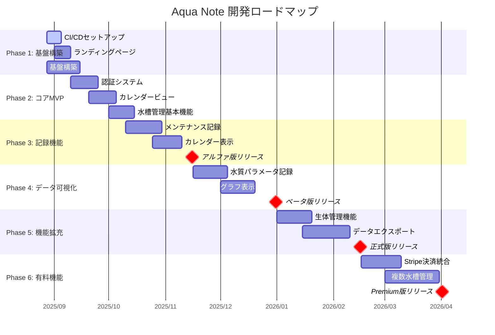
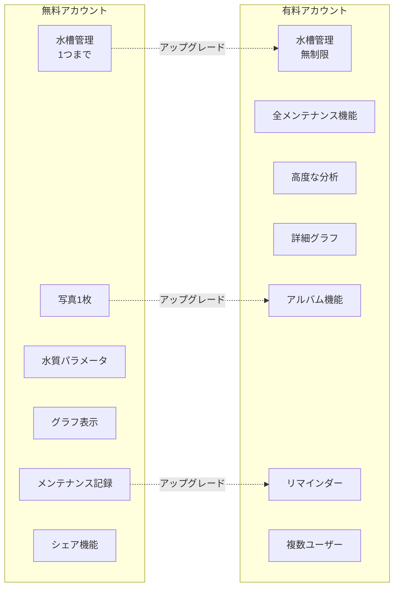

# 🐠 Aqua Note Development Roadmap

最終更新: 2025年8月27日

## 開発フェーズ

## 機能比較マトリックス

## マイルストーン詳細

### 📍 Phase 1: 基盤構築

- ✅ CI/CDパイプライン（GitHub Actions → Cloudflare Workers）
- ✅ Coming Soonページ公開
- ✅ ランディングページ（水中の泡アニメーション）
- ✅ SEO基盤（OGP、sitemap.xml、構造化データ）
- ✅ 法的文書（利用規約、プライバシーポリシー）

### 📍 Phase 2: コアMVP

- 🔄 認証システム（ユーザー登録・ログイン）
- 🔄 カレンダービューコンポーネント
- 🔄 水槽管理基本機能（1つのみ）
- 🔄 国際化対応（日本語・英語）

### 📍 Phase 3: 記録機能（アルファ版）

- ⏳ メンテナンス記録（水換え、給餌、フィルター交換等）
- ⏳ カレンダーでの記録表示
- ⏳ モバイル最適化
- ⏳ **アルファ版として限定公開**

### 📍 Phase 4: データ可視化（ベータ版）

- ⏳ 水質パラメータ記録
- ⏳ グラフ表示（LayerChart）
- ⏳ シェア機能
- ⏳ HTML埋め込みコード
- ⏳ **ベータ版として公開**

### 📍 Phase 5: 機能拡充（正式版）

- ⏳ 水槽写真保存（1枚）
- ⏳ 生体管理機能
- ⏳ データエクスポート（CSV/PDF）
- ⏳ **正式版（無料版）として公開**

### 📍 Phase 6: 有料機能

- ⏳ Stripe決済システム
- ⏳ 複数水槽管理
- ⏳ 高度なアルバム機能
- ⏳ リマインダー・通知機能
- ⏳ **有料プラン導入**

## コミュニケーション

- 📢 **進捗報告**: LPに記載
- 🐛 **バグ報告**: GitHub Issues
- 💡 **機能要望**: GitHub Discussions
